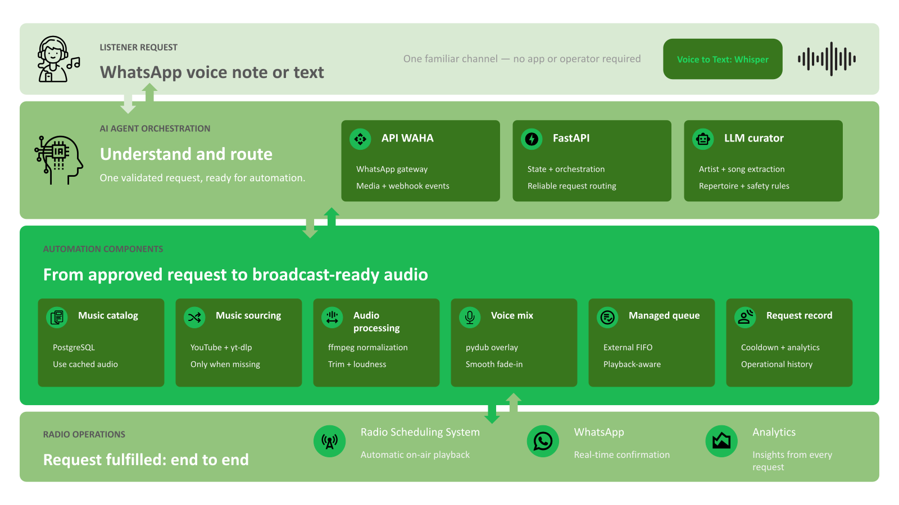
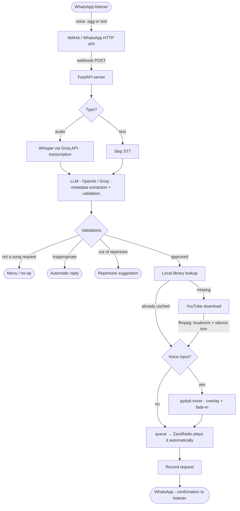

# Virtual Music Agent

> Listeners request songs over WhatsApp. The agent curates each request against the radio station's profile and plays it automatically — end to end, with no human in the loop.

This is a production system built for **Luz FM**, a Brazilian FM station focused on the 30+ "flashback" audience. It is published here as a portfolio piece.

> **Note on language:** this README and the public technical documentation are written in English. Listener-facing messages, prompts, and parts of the domain implementation remain in **Brazilian Portuguese** because the system was built and tuned for a Brazilian radio station.

---

## Overview

A radio station was receiving dozens of song requests per day over WhatsApp — voice notes and text, arriving unsorted, with no triage and no automation. The whole process was manual: a host listened to each audio, identified the song, searched the library, and replied to the listener. At peak hours requests were lost.

This agent closes the full loop automatically:

- Receive requests over WhatsApp (voice or text)
- Understand what the listener wants, even with accents and background noise
- Validate the request against the station's repertoire (30+ flashback)
- Find the song in the local library or download it on demand
- Mix the listener's voice with the requested song using a smooth transition
- Deliver the file straight to the broadcast software's queue
- Reply to the listener with a real-time confirmation

It also ships with a **web analytics dashboard** (Next.js) for the station owner, including cross-filtering charts and an AI insights panel.

---

## Architecture

### Request pipeline



The architecture is organized into four layers: listener input, AI orchestration, audio automation, and radio-station outputs. Voice and text follow the same path after transcription, while rejected or ambiguous requests are handled as automatic WhatsApp responses without entering the audio-production stages.

<details>
<summary><strong>Detailed technical flow (7 steps)</strong></summary>

<br>



</details>

1. **STT** ([core/stt.py](core/stt.py)) — transcribes the `.ogg` voice note via the **Groq Whisper API** (no local model).
2. **LLM** ([core/intelligence.py](core/intelligence.py)) — extracts artist/song and applies business rules (is it a request? is it in repertoire? is it appropriate?). The provider is OpenAI or Groq, selected automatically from the configured keys. Prompt lives in [core/config_radio.py](core/config_radio.py).
3. **Library** ([core/database.py](core/database.py)) — looks the song up in PostgreSQL with accent/case-insensitive matching.
4. **Download** ([core/downloader.py](core/downloader.py)) — if missing, downloads from YouTube via `yt-dlp` and normalizes with `ffmpeg` (loudnorm to -14 LUFS, silence trim).
5. **Mixer** ([core/audio_mixer.py](core/audio_mixer.py)) — overlays the listener's voice over the song with a smooth fade (`pydub`).
6. **Delivery** ([core/queue_watcher.py](core/queue_watcher.py)) — an external FIFO queue feeds ZaraRadio one file at a time and detects playback end (CurrentSong.txt + timer).
7. **Record** — saves the request for the 6-hour per-listener cooldown and for analytics.

Around the pipeline, [server.py](server.py) runs the FastAPI webhook, a per-listener conversation state machine, health checks, a weekly report, and automatic WAHA session reconnection.

### Experimental conversational layer

The conversational layer is isolated behind one webhook seam and reuses the
same musical pipeline only after explicit confirmation. It is selected with
`CONVERSATION_MODE`:

- `legacy` (default): the current flow is used for everyone;
- `allowlist`: only JIDs in `CONVERSATION_ALLOWED_JIDS` use the experiment;
- `all`: every JID uses it.

Invalid or missing configuration safely falls back to `legacy`. The allowlist
uses comma-separated JIDs such as `5511999999999@c.us,12345@lid`. Sessions are
in memory with a 15-minute TTL and one worker is required. `ASSISTANT_PROFILE_PATH`
can point to an external, read-only Markdown profile; otherwise the packaged
profile is used and invalid edits retain the last valid version.

The experimental layer adds one Router call per ordinary conversational turn,
while deterministic production, confirmation and cancellation paths use no LLM
call. A curiosity is optional and may add one best-effort call after success.

---

## Stack

**Backend**

```
Python 3.13      FastAPI            pydub
Whisper (Groq)   yt-dlp / ffmpeg    PostgreSQL (Supabase)
OpenAI / Groq    WAHA (Baileys)     Docker Compose
```

**Dashboard** (`dashboard-web/`)

```
Next.js 14       TypeScript         Recharts
React 18         pg (PostgreSQL)    Tailwind CSS
```

---

## Project structure

```
gpteco/
├── core/
│   ├── pipeline.py        # main orchestrator (7 steps)
│   ├── stt.py             # transcription via Groq Whisper API
│   ├── intelligence.py    # LLM: metadata extraction + validations
│   ├── config_radio.py    # station identity, listener messages, LLM prompt
│   ├── downloader.py      # yt-dlp + ffmpeg (loudnorm -14 LUFS)
│   ├── audio_mixer.py     # pydub: overlay + fade-in
│   ├── database.py        # PostgreSQL: library + requests + cooldown
│   ├── queue_watcher.py   # FIFO queue for ZaraRadio
│   ├── curador.py         # music-trivia "pills" (optional follow-up message)
│   ├── relatorio.py       # analytics + weekly report
│   └── whatsapp.py        # WAHA client (download audio + send messages)
├── server.py              # FastAPI: webhook + background tasks + health
├── main.py                # CLI entry point (single request)
├── scripts/               # one-off DB backfills (genre, phone resolution)
├── dashboard-web/         # Next.js analytics dashboard
├── docker-compose.yml         # local dev (builds the image)
├── docker-compose.dist.yml    # client deployment (prebuilt image)
├── instalar.bat           # Windows installer for client deployment
├── Dockerfile
├── .env.example
└── requirements.txt
```

---

## Installation & running

### Prerequisites

- Docker and Docker Compose (recommended path), **or** Python 3.13 + `ffmpeg` for local runs
- A PostgreSQL database (the project uses [Supabase](https://supabase.com))
- A [Groq](https://console.groq.com) API key (free) and/or an [OpenAI](https://platform.openai.com) API key

### Backend (Docker — recommended)

```bash
# 1. Configure the environment
cp .env.example .env
#    then fill in: GROQ_API_KEY (or OPENAI_API_KEY), DATABASE_URL, WAHA_API_KEY, ...

# 2. Start the stack (FastAPI server + WAHA + Uptime Kuma)
docker compose up -d

# 3. Connect WhatsApp: open the WAHA dashboard and scan the QR code
#    http://localhost:3001/dashboard   (login: admin / WAHA_API_KEY)

# Useful:
docker compose logs -f servidor      # follow logs
docker compose down                  # stop
```

Services after startup:

| Service     | URL                                   | Purpose                          |
|-------------|---------------------------------------|----------------------------------|
| FastAPI     | http://localhost:8002/health          | webhook + health check           |
| WAHA        | http://localhost:3001/dashboard       | WhatsApp gateway (QR / sessions) |
| Uptime Kuma | http://localhost:3002                 | uptime monitoring                |

> `docker-compose.dist.yml` is an alternative for client machines: it pulls a prebuilt image instead of building locally, and `instalar.bat` automates the whole setup on Windows.

### Backend (local, without Docker)

```bash
python -m venv .venv && source .venv/bin/activate
pip install -r requirements.txt          # ffmpeg must be installed and on PATH

cp .env.example .env                      # fill in your keys
uvicorn server:app --host 0.0.0.0 --port 8002
```

You can also process a single request from the command line:

```bash
python main.py --numero 5511999999999 --texto "Quero ouvir Evidências do Chitãozinho e Xororó"
python main.py --numero 5511999999999 --ogg path/to/voice.ogg
```

### Dashboard (`dashboard-web/`)

```bash
cd dashboard-web
npm install
cp .env.local.example .env.local          # set DATABASE_URL (and OPENAI_API_KEY for AI insights)
npm run dev                               # http://localhost:3000
```

The dashboard reads the same PostgreSQL database and renders request analytics (audience heatmap, top genres, fulfillment rate, daily volume) with cross-filtering and an optional AI insights panel.

---

## Results

This system ran in production for a real FM station. Reported honestly:

- **Full end-to-end automation validated in production:** listener voice → request identified → song downloaded → mixed → ZaraRadio queue, with no human intervention.
- **Robust to noisy input:** the LLM normalizes phonetic errors from speech-to-text (e.g. "morder talk" → "Modern Talking") and asks for confirmation when unsure.
- **Repertoire-aware:** requests are validated against the station's genre rules with a chain-of-thought step before the decision.
- **Local caching:** once a song is downloaded and normalized, future requests for it are served instantly from the library.
- **Operational resilience:** the queue watcher self-restarts via a watchdog, the WhatsApp session auto-reconnects, and `/health` reports WAHA, database, queue and disk status.
- **Owner-facing analytics:** a weekly WhatsApp report plus a web dashboard with cross-filtering and AI-generated insights.

### Limitations & honesty notes

- **No benchmark numbers are claimed here.** Latency depends on whether the song is cached and on third-party APIs (Groq/OpenAI, YouTube), so I am not publishing timing figures I cannot reproduce from artifacts in this repo.
- **No automated test suite.** There is a manual mixer test script ([test_mixer.py](test_mixer.py)); the rest was validated through real usage.
- **External dependencies:** the system relies on WAHA (WhatsApp), Groq/OpenAI, a YouTube source for downloads, and a PostgreSQL instance.
- **ZaraRadio integration is Windows/file-based:** delivery targets ZaraRadio through a watched folder and its `CurrentSong.txt`, which is specific to that broadcast software.

---

## License

[MIT](LICENSE) © Lucas Borges
