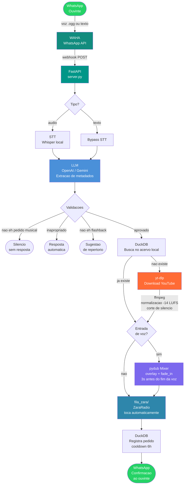
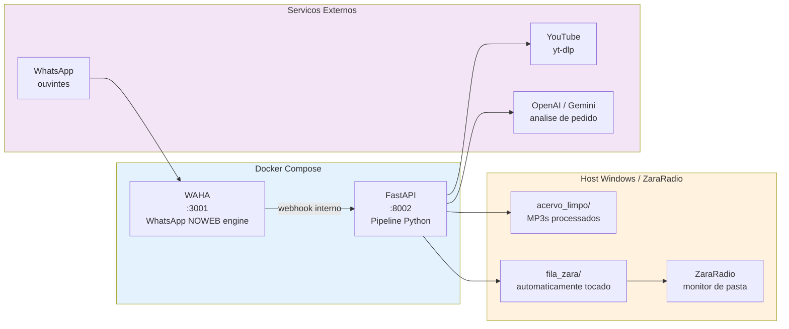

# Agente Virtual Musical

> Ouvintes pedem músicas pelo WhatsApp. A rádio toca automaticamente.

---

## Situação

Uma rádio FM com foco no público 30+ recebia dezenas de pedidos musicais por dia via WhatsApp — mensagens de voz e texto chegando de forma desordenada, sem triagem, sem automação.

O processo era 100% manual: o locutor ouvia cada áudio, identificava a música, buscava no acervo, e ainda precisava responder ao ouvinte. Nos horários de pico, pedidos se perdiam. A experiência do ouvinte era inconsistente.

---

## Tarefa

Construir um agente de IA que fechasse o ciclo completo de ponta a ponta:

- Receber pedidos via WhatsApp (voz ou texto)
- Entender o que o ouvinte quer, mesmo com sotaque e ruído de fundo
- Validar se o pedido está dentro do repertório da rádio (flashback 30+)
- Buscar ou baixar a música automaticamente
- Mixar a voz do ouvinte com a música pedida, com transição suave
- Entregar o arquivo diretamente na fila do software de transmissão
- Responder ao ouvinte com confirmação em tempo real

Tudo isso sem intervenção humana.

---

## Acao

### Pipeline de 7 Etapas



### Arquitetura de Servicos



---

## Resultados

- Pipeline end-to-end validado: voz do ouvinte → pedido identificado → musica baixada → mixagem → fila do ZaraRadio, sem intervencao humana
- Tempo medio por pedido de texto: **~15–30s** (sem download) / **~60–90s** (com download do YouTube)
- Acervo com cache local: downloads futuros da mesma musica sao instantaneos
- Resposta automatica ao ouvinte com confirmacao ou motivo de recusa
- Sistema containerizado: `docker compose up -d` e esta pronto

---

## Stack

```
Python 3.12       FastAPI          pydub
Whisper (local)   yt-dlp           ffmpeg
DuckDB            OpenAI / Gemini  WAHA (Baileys)
Docker Compose    ZaraRadio (FM)
```

---

## Estrutura do Projeto

```
gpteco/
├── core/
│   ├── pipeline.py       # orquestrador principal (7 etapas)
│   ├── stt.py            # transcricao Whisper local
│   ├── intelligence.py   # LLM: extracao de metadados + validacoes
│   ├── downloader.py     # yt-dlp + ffmpeg (loudnorm -14 LUFS)
│   ├── audio_mixer.py    # pydub: overlay + fade_in
│   ├── database.py       # DuckDB: acervo + pedidos + cooldown
│   ├── queue_watcher.py  # fila FIFO para o ZaraRadio
│   └── whatsapp.py       # cliente WAHA (download audio + envio)
├── server.py             # FastAPI: webhook + background tasks
├── main.py               # CLI entry point
├── docker-compose.yml
├── .env.example
└── requirements.txt
```
