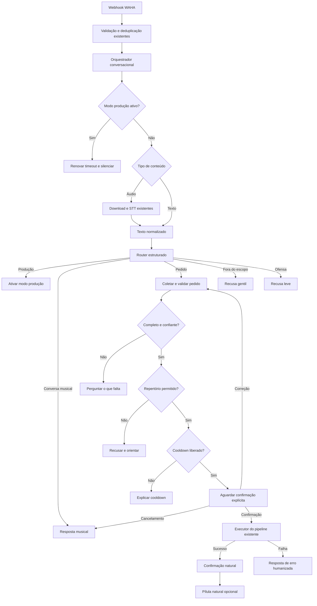
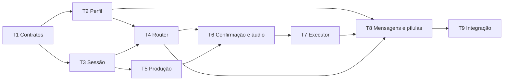

# SDD — Luzia Conversacional com LangGraph

- **Status:** proposta pronta para implementação
- **Data:** 14 de agosto de 2026
- **Sistema:** Agente Virtual Musical / AKAPO
- **Primeiro cliente:** Luz FM

---

## 1. Resumo executivo

Esta evolução transforma a Luzia, hoje concentrada em interpretar e executar
pedidos musicais, em uma assistente musical conversacional para WhatsApp.

A assistente deverá:

- conversar sobre músicas dentro do público-alvo configurado pela rádio;
- responder perguntas sobre artistas, álbuns, letras, shows e história da
  música;
- interpretar pedidos musicais em texto ou áudio;
- esclarecer pedidos incompletos ou ambíguos;
- exigir confirmação explícita antes de executar qualquer pedido;
- respeitar repertório e cooldown antes de oferecer a confirmação;
- encaminhar produção, reclamações, denúncias e promoções para atendimento
  humano;
- permanecer totalmente inativa durante o modo produção;
- comunicar recusas e falhas com linguagem natural e segura;
- apresentar pílulas de curiosidade como parte natural da conversa.

LangGraph será usado como orquestrador de uma máquina de estados
conversacional controlada. A LLM interpretará linguagem e redigirá respostas,
mas não decidirá nem executará livremente regras críticas.

O pipeline musical existente continuará responsável por acervo, download,
mixagem, ZaraRadio e registro. A mudança deve ocorrer em uma nova costura antes
desse pipeline, preservando suas dependências e efeitos externos.

---

## 2. Objetivos

### 2.1 Objetivos funcionais

1. Substituir menus e confirmações rígidas por uma conversa curta, natural e
   contextual.
2. Permitir alguns turnos de bate-papo sobre o universo musical da rádio.
3. Reconhecer automaticamente quando o ouvinte quer falar com a produção.
4. Manter todas as regras atuais de repertório, cooldown e execução musical.
5. Exigir confirmação explícita para todo pedido, inclusive pedidos claros.
6. Humanizar recusas, dúvidas, confirmações, curiosidades e falhas técnicas.
7. Permitir que cada cliente personalize identidade, tom e público-alvo sem
   editar prompts técnicos.

### 2.2 Objetivos técnicos

1. Concentrar a complexidade conversacional em um módulo profundo com uma
   interface pequena.
2. Manter WAHA, transcrição, banco, download, mixagem, fila e ZaraRadio atrás
   das interfaces atuais ou de adaptadores estreitos.
3. Tornar transições de estado testáveis sem chamar serviços externos.
4. Evitar chamadas redundantes à LLM.
5. Permitir ativação gradual e rollback por configuração.

### 2.3 Métrica de sucesso

A principal métrica de produto é a satisfação do ouvinte. Na primeira versão,
a avaliação será qualitativa, pela revisão das conversas no WhatsApp da rádio e
por feedback da produção. Esta spec não cria pesquisa automática de satisfação
nem persistência adicional de conversas.

---

## 3. Fora do escopo

Esta entrega não deve:

- alterar a conexão, sessão ou protocolo do WAHA;
- transcrever áudios recebidos durante o modo produção;
- alterar o algoritmo de transcrição;
- alterar a busca no acervo, o download, o processamento com ffmpeg ou a
  mixagem;
- alterar o mecanismo de entrega ao ZaraRadio;
- criar posição de pedido na fila;
- prometer horário de execução ou aviso quando a música tocar;
- adicionar pesquisa web, RAG ou uma nova base de conhecimento musical;
- criar memória permanente do ouvinte entre sessões;
- persistir o histórico conversacional para analytics;
- adotar um agente autônomo genérico ou permitir que a LLM execute operações
  críticas sem validação determinística;
- adotar checkpointer PostgreSQL na primeira versão;
- alterar o dashboard ou os relatórios existentes, salvo adaptação estritamente
  necessária a um novo código de resultado do pedido.

---

## 4. Decisões consolidadas

| Tema | Decisão |
|---|---|
| Orquestração | LangGraph com grafo explícito e controlado |
| LangChain | Opcional e mínimo, apenas se simplificar modelo e saída estruturada |
| Memória | Em processo, por JID, com TTL configurável |
| Checkpointer PostgreSQL | Não será usado na V1 |
| Persistência de conversa | Nenhuma entre sessões |
| Público-alvo | Configurável por gêneros, décadas e artistas |
| Conhecimento musical | Conhecimento geral do modelo, sem fontes externas |
| Assuntos permitidos | Artistas, álbuns, letras, shows e história da música dentro do público-alvo |
| Assuntos fora do escopo | Recusa gentil, lembrando o escopo musical da rádio |
| Personalidade | Configurável por cliente; Luz FM usa “Luzia, a assistente virtual da rádio”, animada, informal e mineira |
| Ofensas | Recusa breve, leve e sem hostilidade |
| Confirmação | Obrigatória para todo pedido musical |
| Cooldown | Impede somente novo pedido; conversa musical continua disponível |
| Repertório | Primeiro filtro operacional do pedido |
| Produção | Tem prioridade sobre qualquer outra intenção |
| Timeout da produção | Cinco minutos desde a última mensagem do ouvinte |
| Resposta da produção | Não altera nem reinicia o timeout |
| Áudio em produção | Não baixar nem transcrever; permanecer silencioso |
| Curiosidade | Opcional, natural, sem título ou anúncio “CURIOSIDADE” |
| Falhas | Resultado técnico estruturado + resposta natural + fallback fixo |

---

## 5. Vocabulário do domínio

### Ouvinte

Pessoa que conversa com a rádio pelo WhatsApp. O JID completo fornecido pelo
WAHA identifica sua sessão.

### Sessão conversacional

Contexto temporário de um ouvinte, mantido apenas em memória. Contém mensagens
recentes, estado atual e eventual pedido pendente. Expira após inatividade.

### Modo assistente

Modo normal no qual texto e áudio podem ser interpretados pela Luzia. Áudios
são baixados e transcritos apenas neste modo.

### Modo produção

Janela de atendimento humano durante a qual a Luzia não chama a LLM, não baixa
nem transcreve áudio e não envia respostas. A única exceção é a mensagem
enviada no momento da ativação do modo.

### Pedido pendente

Pedido musical já interpretado, aprovado pelo repertório e liberado pelo
cooldown, mas ainda não confirmado explicitamente pelo ouvinte.

### Pedido confirmado

Pedido pendente que recebeu confirmação inequívoca do ouvinte e está autorizado
a entrar no pipeline musical.

### Repertório permitido

Regra editorial da rádio baseada em gêneros, décadas, artistas, inclusões e
exclusões. É diferente de disponibilidade no acervo local.

### Disponibilidade no acervo

Indica se a faixa já existe localmente. Só é consultada depois de o pedido
passar pelo repertório, cooldown e confirmação.

### Pílula musical

Curiosidade opcional sobre a faixa confirmada. É um complemento best-effort e
nunca pode afetar a execução do pedido.

---

## 6. Arquitetura-alvo



### 6.1 Costura principal

O webhook continua responsável por preocupações de transporte:

- validar o payload;
- ignorar grupos e mensagens `fromMe`;
- deduplicar eventos;
- devolver HTTP 200 rapidamente;
- agendar o processamento em background;
- enviar as mensagens resultantes pelo WhatsApp.

A complexidade de interpretação, estado e decisão fica atrás da interface do
orquestrador conversacional.

Interface conceitual:

```python
resultado = await orquestrador.processar(mensagem_recebida)
```

O chamador precisa conhecer apenas a mensagem recebida e o resultado. O módulo
esconde Router, estado, confirmação, timeout, perfil da rádio e composição de
respostas.

### 6.2 Resultado conversacional

O resultado deve expressar fatos e ações de forma tipada, sem exigir que o
`server.py` conheça as transições internas:

```python
ConversationResult(
    replies=[...],
    silent=False,
    state="awaiting_confirmation",
)
```

Quando houver uma confirmação válida, o próprio orquestrador invoca o executor
musical injetado e devolve a resposta final. O `server.py` não precisa conhecer
pedido pendente, confirmação, códigos do pipeline ou transições internas; ele
apenas envia `replies` ou respeita `silent`.

### 6.3 Dependências do orquestrador

As dependências variáveis devem ser recebidas, e não criadas dentro do módulo:

- relógio;
- Router/LLM;
- armazenamento de sessão em memória;
- verificador de cooldown;
- executor musical;
- transcrição e download de áudio existentes;
- carregador do perfil da assistente;

Isso permite testar o mesmo fluxo por sua interface usando adaptadores falsos,
sem rede, banco, ffmpeg ou ZaraRadio.

---

## 7. Estado conversacional

### 7.1 Estados

| Estado | Significado |
|---|---|
| `idle` | Sem conversa ou pedido em andamento |
| `conversing` | Conversa musical ativa |
| `collecting_request` | Falta música, artista ou esclarecimento |
| `awaiting_confirmation` | Pedido completo aguardando confirmação explícita |
| `executing_request` | Pedido confirmado em execução; novas confirmações não duplicam a ação |
| `production` | Atendimento humano ativo; Luzia silenciosa |

Cooldown e erro não são estados duradouros. São resultados de uma decisão.

### 7.2 Dados da sessão

O estado deve guardar dados brutos:

```python
ConversationState(
    jid="...",
    mode="conversing",
    recent_messages=[],
    pending_request=None,
    last_listener_message_at=None,
    production_expires_at=None,
    session_expires_at=None,
)
```

Um `PendingRequest` deve conter, quando aplicável:

- música normalizada;
- artista normalizado;
- gênero ou classificação editorial;
- transcrição original;
- texto original;
- caminho do `.ogg` temporário;
- origem `text` ou `audio`;
- horário de criação e expiração;
- identificador da mensagem que originou o pedido.

Prompts, mensagens formatadas e regras não devem ser armazenados no estado.

### 7.3 Expiração

- TTL inicial recomendado: 15 minutos após a última mensagem do ouvinte.
- O valor deve ser configurável.
- A sessão mantém no máximo 10 mensagens recentes por padrão.
- Ao expirar, remove contexto, pedido pendente e eventual áudio temporário.
- Entrar no modo produção também cancela pedido pendente e remove seu áudio.
- Após reinicialização do servidor, todas as sessões em memória são perdidas.

### 7.4 Recuperação após reinicialização

Perder o estado em uma reinicialização é um comportamento aceito na V1.

Se o ouvinte enviar uma confirmação sem existir pedido pendente, Luzia deve
pedir novamente música e artista em linguagem natural. O sistema nunca deve
tentar reconstruir ou executar um pedido apenas a partir de “sim”.

Arquivos temporários órfãos devem ser removidos por idade na inicialização ou
por uma rotina periódica de limpeza.

### 7.5 Restrição operacional

Enquanto o estado estiver apenas em memória, o servidor deve operar com uma
única instância/processo responsável pelos webhooks. Múltiplos workers ou
réplicas exigirão armazenamento compartilhado e ficam fora da V1.

---

## 8. Router de intenção

### 8.1 Intenções

O Router deve produzir uma saída estruturada com uma das intenções:

| Intenção | Exemplos | Destino |
|---|---|---|
| `production` | “Quero falar com a produção” | Modo produção |
| `complaint` | Reclamação sobre rádio, programação ou atendimento | Modo produção |
| `report` | Denúncia | Modo produção |
| `promotion` | Participação ou dúvida sobre promoção | Modo produção |
| `music_request` | Pedido de uma faixa | Fluxo de pedido |
| `music_question` | Pergunta ou comentário musical permitido | Conversa musical |
| `music_question_and_request` | Pergunta e pedido na mesma mensagem | Responder e depois tratar pedido |
| `greeting` | Cumprimento sem pedido | Conversa musical |
| `off_topic` | Assunto não musical | Recusa gentil |
| `inappropriate` | Ofensa direta ou conteúdo inadequado | Recusa leve |
| `unclear` | Não foi possível compreender a intenção | Pergunta curta de esclarecimento |

### 8.2 Prioridade

A ordem de precedência é:

1. modo produção já ativo;
2. produção, reclamação, denúncia ou promoção;
3. segurança e adequação;
4. pergunta musical combinada com pedido;
5. pedido musical;
6. pergunta ou conversa musical;
7. fora do escopo ou ambígua.

Uma reclamação que também contenha pedido musical entra no modo produção e não
executa nem conserva o pedido.

### 8.3 Saída estruturada

Além da intenção, o Router pode retornar em uma única chamada:

- música e artista detectados;
- confiança da extração;
- gênero/década/artista relacionados ao público-alvo;
- adequação ao repertório;
- campos ausentes;
- resposta musical curta, quando aplicável;
- motivo interno da classificação;
- indicação de ofensa.

O motivo interno nunca deve ser enviado ao ouvinte.

### 8.4 Economia de chamadas

O Router e a extração do pedido devem compartilhar uma chamada estruturada.
Uma mensagem não deve passar por um classificador e depois por outro extrator
com o mesmo contexto.

Confirmações inequívocas, cancelamentos, modo produção ativo e respostas fixas
de segurança devem ser tratados sem LLM sempre que possível.

---

## 9. Conversa musical

### 9.1 Escopo permitido

A Luzia pode conversar livremente, por alguns turnos, sobre:

- artistas;
- bandas;
- músicas;
- álbuns;
- letras e seus significados;
- shows;
- gêneros e movimentos;
- história e curiosidades musicais.

O assunto deve estar relacionado aos gêneros, décadas ou artistas definidos no
perfil da rádio.

### 9.2 Fora do público-alvo

A assistente deve recusar gentilmente e explicar que só pode comentar músicas
do universo musical daquela rádio. Pode sugerir que o ouvinte pergunte sobre
um gênero, década ou artista aceito, sem inventar uma música específica.

### 9.3 Fora de música

Qualquer tema não musical deve ser recusado. A resposta deve ser curta e
redirecionar para música ou para um pedido musical.

### 9.4 Estilo da resposta

- simples e adequada ao WhatsApp;
- normalmente uma ou duas mensagens curtas;
- informal e animada conforme o perfil;
- sem textos promocionais repetitivos;
- sem fingir ser uma pessoa;
- deve se identificar conforme o perfil, por exemplo: “Luzia, a assistente
  virtual da rádio”;
- regionalismo mineiro deve soar natural e não caricato;
- no máximo uma pergunta objetiva por resposta quando faltar informação.

---

## 10. Fluxo de pedido musical

### 10.1 Ordem obrigatória

1. Identificar intenção.
2. Extrair música e artista.
3. Perguntar o que faltar ou esclarecer ambiguidade.
4. Verificar repertório permitido.
5. Verificar cooldown.
6. Solicitar confirmação explícita.
7. Consumir a confirmação de forma atômica.
8. Executar o pipeline musical.
9. Comunicar sucesso ou falha.
10. Enviar pílula opcional após sucesso.

Busca no acervo, download, mixagem e ZaraRadio só começam no passo 8.

### 10.2 Dados incompletos

Se música ou artista estiver ausente, a Luzia pergunta pelo campo que falta.
Não deve escolher automaticamente um hit do artista nem completar um artista
com base apenas em probabilidade.

### 10.3 Repertório

Repertório é o primeiro filtro operacional. Um pedido fora do repertório:

- não consulta acervo;
- não baixa música;
- não entra em cooldown;
- não pede confirmação;
- recebe explicação natural e orientação compatível com a rádio.

### 10.4 Cooldown

Se o pedido estiver no repertório, o sistema verifica o cooldown existente.

Durante o cooldown:

- a Luzia continua respondendo perguntas musicais;
- um novo pedido é recusado com explicação leve;
- não se pede confirmação;
- não se informa posição na fila;
- não se inventa o horário exato de liberação.

### 10.5 Confirmação explícita

A confirmação deve apresentar música e artista completos. Exemplos aceitos:

- “sim”;
- “isso”;
- “pode colocar”;
- equivalentes inequívocos definidos e testados.

Uma confirmação só vale quando existe `pending_request` na sessão.

Respostas negativas cancelam o pedido. Correções atualizam os dados e geram uma
nova confirmação completa. Um novo pedido substitui o anterior após nova
validação.

### 10.6 Pergunta e pedido na mesma mensagem

A Luzia deve:

1. responder a pergunta musical;
2. validar o pedido;
3. se houver cooldown, explicar por que não pode adicioná-lo;
4. se estiver liberado, solicitar confirmação explícita.

### 10.7 Execução idempotente

A confirmação deve ser consumida uma única vez e o estado deve mudar para
`executing_request` antes do primeiro efeito externo.

Mensagem duplicada do WAHA ou múltiplos “sim” não podem gerar downloads,
mixagens ou entradas duplicadas no ZaraRadio.

---

## 11. Áudio

### 11.1 Regra por modo

| Situação | Baixar | Transcrever | Responder |
|---|---:|---:|---:|
| Modo assistente | Sim | Sim | Sim |
| Modo produção | Não | Não | Não |

O modo deve ser consultado antes de qualquer download de mídia.

### 11.2 Pedido claro por áudio

Mesmo quando a transcrição e a identificação forem confiáveis:

1. preservar o `.ogg` temporário;
2. salvar seu caminho no pedido pendente;
3. pedir confirmação explícita;
4. reutilizar o áudio original na mixagem após a confirmação;
5. remover o arquivo após sucesso ou encerramento seguro da tentativa.

### 11.3 Pedido ambíguo por áudio

A Luzia pergunta o dado ausente ou confirma a interpretação. A correção textual
do ouvinte atualiza os metadados e conserva o áudio original para a mixagem.

### 11.4 Limpeza

O `.ogg` deve ser removido quando ocorrer qualquer um destes eventos:

- execução concluída;
- pedido cancelado;
- pedido substituído;
- entrada no modo produção;
- expiração da sessão;
- falha definitiva sem possibilidade segura de retry;
- limpeza de órfãos por idade após reinicialização.

Nunca armazenar o conteúdo do áudio no estado ou no PostgreSQL; apenas o caminho
temporário.

---

## 12. Modo produção

### 12.1 Ativação

Ativar quando o Router identificar:

- pedido explícito para falar com a produção;
- reclamação;
- denúncia;
- assunto relacionado a promoção.

A Luzia envia uma única mensagem natural informando que a equipe continuará o
atendimento e então entra em silêncio.

### 12.2 Regra do timeout móvel

- duração: cinco minutos;
- referência: última mensagem recebida do ouvinte;
- cada nova mensagem do ouvinte renova os cinco minutos;
- mensagem enviada pela produção não altera o timer;
- não existe encerramento manual na V1;
- durante a janela não há LLM, resposta, download ou transcrição;
- após expirar, a próxima mensagem do ouvinte segue o fluxo normal.

### 12.3 Estado perdido por reinicialização

Como a V1 usa memória em processo, reiniciar o servidor encerra o modo produção.
Esse risco é aceito inicialmente. Se a operação demonstrar impacto relevante,
a primeira evolução recomendada é persistir apenas modo e expiração, antes de
adotar checkpoint completo do grafo.

---

## 13. Execução do pipeline musical

### 13.1 Preservação

O projeto conversacional deve preservar as interfaces e o comportamento vigente
de:

- busca no PostgreSQL;
- download com yt-dlp;
- normalização com ffmpeg;
- mixagem;
- fila externa;
- ZaraRadio;
- registro do pedido;
- cache e tracking de pílulas.

O baseline do downloader inclui:

- avaliar vários resultados de duração plausível, em vez de depender apenas do
  primeiro resultado da busca;
- tentar o próximo candidato quando um download falhar, inclusive por HTTP 403;
- remover artefatos parciais depois de cada tentativa malsucedida;
- realizar uma segunda busca com `lyrics` quando os resultados da busca
  principal estiverem bloqueados ou indisponíveis;
- remover o temporário escolhido mesmo quando ffmpeg ou registro no acervo
  falharem;
- atualizar o yt-dlp durante o build da imagem e registrar a versão resolvida
  para permitir diagnóstico do artefato implantado.

Essas tentativas pertencem à implementação interna do downloader. Router,
orquestrador e ouvinte devem enxergar uma única operação: preparar a faixa ou
retornar uma falha final estruturada.

### 13.2 Nova interface de execução confirmada

O pipeline deve oferecer uma entrada capaz de receber dados já confirmados:

```python
executar_pedido_confirmado(
    numero=jid,
    artista=artista,
    musica=musica,
    path_ogg=path_opcional,
)
```

Essa interface evita chamar novamente o Router ou interpretar a palavra “sim”
como se fosse um novo pedido.

O cooldown deve ser revalidado imediatamente antes da execução para proteger
contra concorrência ou passagem de tempo entre análise e confirmação.

### 13.3 Compatibilidade

O ponto de entrada atual `processar_pedido()` deve ser preservado enquanto for
usado pelo CLI ou por fluxos legados. A nova interface pode reutilizar a
implementação interna existente, sem duplicar download, mixagem ou entrega.

---

## 14. Falhas e respostas humanizadas

### 14.1 Princípio

O pipeline decide o fato técnico; a camada conversacional decide como comunicá-lo.
A LLM nunca deve inventar sucesso, etapa concluída ou causa não fornecida pelo
pipeline.

### 14.2 Resultado estruturado

O executor deve retornar um código seguro, por exemplo:

| Código | Significado para o sistema | Comportamento conversacional |
|---|---|---|
| `success` | Pedido entrou na fila | Confirmar naturalmente |
| `cooldown` | Regra mudou antes da execução | Explicar a espera |
| `stt_unintelligible` | Áudio não compreendido | Pedir novo áudio ou texto |
| `request_not_identified` | Música/artista insuficientes | Perguntar o que falta |
| `out_of_repertoire` | Pedido editorialmente recusado | Explicar e redirecionar |
| `source_not_found` | Nenhum resultado apropriado foi encontrado | Informar que não conseguiu localizar a faixa |
| `download_failed` | Todos os candidatos e fallbacks aplicáveis falharam | Pedir tentativa posterior |
| `mix_failed` | Falha ao gerar o áudio final | Informar que não concluiu |
| `queue_failed` | Não foi possível entregar ao ZaraRadio | Não afirmar que entrou na fila |
| `database_failed` | Registro ou consulta essencial falhou | Mensagem segura e genérica |
| `llm_unavailable` | Router ou compositor indisponível | Usar fallback fixo |
| `unexpected_error` | Falha desconhecida | Usar fallback fixo e registrar internamente |

HTTP 403, indisponibilidade de um candidato, busca com `lyrics`, YouTube e
yt-dlp são detalhes internos. Nenhum deles deve gerar mensagem intermediária
nem aparecer no WhatsApp. `download_failed` só pode ser retornado depois de o
downloader esgotar os candidatos e fallbacks aplicáveis.

Detalhes técnicos e exceções nunca devem aparecer no WhatsApp.

### 14.3 Composição da resposta

- Se a LLM estiver disponível, pode redigir a mensagem respeitando o código e
  as restrições recebidas.
- Se a LLM causou a falha ou também estiver indisponível, usar texto fixo do
  perfil.
- A resposta deve ser breve, humana e sem promessa de horário.
- O erro não deve ser apresentado como punição ao ouvinte.
- O sistema não deve convidar a repetir imediatamente quando houver risco de
  duplicar um pedido em estado incerto.

Fallback inicial da Luz FM:

> Ô, parece que alguma coisa saiu do ritmo por aqui e não consegui concluir seu
> pedido agora. Tenta de novo daqui a pouquinho?

### 14.4 Falhas parciais

É necessário distinguir falha antes e depois da entrega ao ZaraRadio. Se a
música já tiver sido enfileirada, uma falha posterior de resposta ou registro
não pode autorizar nova execução automática nem informar falsamente que o
pedido falhou.

---

## 15. Pílulas musicais

- Continuam opcionais e best-effort.
- Só podem ser enviadas após sucesso confirmado do pedido.
- Cache e prevenção de repetição continuam existentes.
- Não devem começar com “CURIOSIDADE”, “Você sabia?” ou outro anúncio fixo.
- Podem usar uma ponte natural relacionada à conversa.
- Não bloqueiam nem alteram sucesso do pedido.
- Falhas de geração, personalização ou envio são silenciosas.
- Não enviar se o ouvinte tiver entrado no modo produção antes do disparo.

Exemplo de abertura aceitável:

> E essa tem uma história boa: ...

---

## 16. Perfil editável da assistente

### 16.1 Formato e localização

Usar Markdown validado, com frontmatter simples e seções estáveis. O arquivo
deve ficar na pasta de instalação do cliente, próximo ao `.env` e aos arquivos
Docker, e ser montado no contêiner em modo somente leitura.

Configuração proposta:

```env
ASSISTANT_PROFILE_PATH=/app/config/assistente.md
```

O arquivo atual `core/luzia/luzia.md` é a base da migração. Seu carregamento com
hot reload e fallback para a última versão válida deve ser preservado.

### 16.2 Conteúdo editável pelo cliente

- nome da rádio;
- nome e apresentação da assistente;
- tom e nível de informalidade;
- regionalismo;
- gêneros, décadas e artistas do público-alvo;
- inclusões e exclusões do repertório;
- assuntos musicais permitidos;
- tamanho e estilo das respostas;
- bordões, emojis e termos a evitar;
- exemplos de respostas desejadas;
- mensagens fixas de fallback e segurança.

### 16.3 Conteúdo protegido

Não expor como edição livre do cliente:

- schema da saída estruturada do Router;
- nomes das intenções;
- regras de prioridade;
- confirmação obrigatória;
- idempotência;
- timeout e semântica do modo produção;
- códigos de resultado do pipeline;
- instruções capazes de acionar download, mixagem ou ZaraRadio;
- salvaguardas contra promessas falsas.

Essas regras permanecem no código ou em prompt técnico interno.

### 16.4 Validação

- validar na inicialização;
- validar em comando próprio para instalação/CI;
- ao detectar edição inválida em hot reload, manter a última configuração boa;
- registrar erro claro para a equipe sem interromper o atendimento;
- nunca enviar comentários ou instruções do Markdown ao ouvinte.

---

## 17. Configuração proposta

```env
# Seleção experimental e rollback imediato
CONVERSATION_MODE=legacy
CONVERSATION_ALLOWED_JIDS=

# Sessão em memória
CONVERSATION_SESSION_TIMEOUT_MIN=15
CONVERSATION_HISTORY_MAX_MESSAGES=10

# Produção
PRODUCAO_TIMEOUT_MIN=5

# Perfil editável
ASSISTANT_PROFILE_PATH=/app/config/assistente.md

# Modelo do Router/respostas
CONVERSATION_MODEL=<modelo configurado pelo deploy>
```

Os modos são:

- `legacy`: todos usam exatamente o fluxo atual;
- `allowlist`: somente os JIDs em `CONVERSATION_ALLOWED_JIDS` usam a camada
  conversacional;
- `all`: todos usam a camada conversacional.

O padrão é `legacy`. Configuração ausente, vazia ou inválida cai com segurança
em `legacy`. A seleção ocorre em uma única costura do webhook, depois da
validação/deduplicação e antes dos estados legados, download de mídia e STT.
Em `legacy`, perfil externo e inicialização conversacional não são requisitos.

---

## 18. Custos e desempenho

### 18.1 Limites de chamadas à LLM

- modo produção ativo: zero chamadas;
- confirmação ou cancelamento inequívoco: zero chamadas quando houver regra
  determinística suficiente;
- mensagem comum: preferencialmente uma chamada unindo Router, extração e
  resposta curta;
- execução após confirmação: não repetir análise musical pela LLM;
- pílula: chamada adicional apenas em cache miss, como fluxo opcional;
- falha de LLM: fallback fixo sem nova tentativa recursiva de composição.

### 18.2 Contexto

Enviar somente:

- perfil necessário ao turno;
- estado bruto relevante;
- no máximo a janela configurada de mensagens recentes;
- mensagem atual.

Não enviar todo o histórico do WhatsApp. Não gerar resumo por LLM na V1.

### 18.3 Latência

Saudações, produção, confirmações e regras determinísticas não devem aguardar
uma chamada desnecessária à LLM. O webhook continua devolvendo HTTP 200 antes
do processamento em background.

As tentativas internas do downloader podem aumentar o tempo no estado
`executing_request`. Nesse período:

- enviar no máximo uma mensagem natural de progresso;
- não anunciar cada candidato, erro 403 ou busca alternativa;
- manter a reserva do JID e impedir uma segunda execução;
- emitir sucesso ou falha somente após o resultado final do downloader.

---

## 19. Concorrência e segurança operacional

- manter deduplicação por `message_id`;
- serializar processamento por JID;
- mudar para `executing_request` antes do primeiro efeito externo;
- impedir duas execuções simultâneas do mesmo pedido pendente;
- não reutilizar arquivo temporário depois de removido;
- não armazenar áudio no banco;
- não expor prompts, exceções, chaves ou caminhos locais ao ouvinte;
- preservar o uso de um único worker enquanto o estado for em memória;
- registrar internamente intenção, transição, código de resultado e duração,
  sem registrar chain-of-thought da LLM;
- nunca solicitar nem armazenar dados pessoais além do identificador necessário
  ao atendimento atual.

---

## 20. Compatibilidade e rollout

### 20.1 Estratégia

1. Adicionar o novo módulo sem substituir imediatamente o fluxo legado.
2. Cobrir comportamento atual com testes de regressão.
3. Habilitar a conversa por `CONVERSATION_MODE=allowlist` em ambiente controlado.
4. Validar texto antes de habilitar áudio.
5. Validar áudio com confirmação obrigatória.
6. Habilitar para o cliente atual.
7. Observar conversas e satisfação.
8. Remover menus e estados legados somente após estabilização.

### 20.2 Rollback

Há dois níveis de rollback, ambos sem migração de banco ou alteração no WAHA,
ZaraRadio e diretórios de música:

1. **Rollback de seleção:** voltar `CONVERSATION_MODE` para `legacy` (ou
   remover a configuração) restaura imediatamente o fluxo anterior no webhook.
2. **Rollback de imagem:** executar a imagem estável anterior, identificada por
   tag imutável ou digest, restaura também o conjunto de dependências sem
   publicar nem modificar o estado do cliente durante este experimento.

### 20.3 Publicação e verificação futura da imagem

Esta implementação apenas constrói e testa a imagem localmente. Não publica no
Docker Hub nem altera o computador do cliente. Antes de um rollout futuro, a
imagem deve receber uma tag imutável de RC, o digest deve ser registrado e a
tag/digest efetivamente executado deve ser conferido no cliente. O uso isolado
de `latest` não comprova qual build está ativo.

---

## 21. Estratégia de testes

### 21.1 Testes do Router

- pedido completo;
- pedido sem artista;
- pedido sem música;
- pergunta musical;
- pergunta e pedido combinados;
- reclamação com pedido musical;
- denúncia;
- promoção;
- assunto fora de música;
- artista fora do público-alvo;
- ofensa direta;
- saudação e agradecimento;
- transcrição com erro fonético;
- saída inválida ou indisponibilidade da LLM.

### 21.2 Testes de estado

- `idle` para conversa;
- coleta de dados incompletos;
- confirmação positiva;
- correção seguida de nova confirmação;
- cancelamento;
- substituição do pedido;
- expiração da sessão;
- confirmação sem pedido pendente;
- mensagens concorrentes do mesmo JID;
- confirmação duplicada;
- entrada em produção a partir de qualquer estado;
- limpeza do pedido e áudio ao entrar em produção.

### 21.3 Testes do modo produção com relógio falso

- ativação envia uma única resposta;
- mensagens seguintes permanecem silenciosas;
- cada mensagem renova cinco minutos;
- resposta da produção não altera o timer;
- áudio não é baixado nem transcrito;
- primeira mensagem após expiração volta ao modo assistente.

### 21.4 Testes de áudio

- áudio claro gera pedido pendente, não execução imediata;
- confirmação reutiliza o `.ogg` original;
- correção atualiza metadados;
- cancelamento remove o arquivo;
- expiração remove o arquivo;
- reinicialização/limpeza remove órfão antigo;
- modo produção não chama downloader de mídia nem STT.

### 21.5 Testes do pipeline

- somente pedido confirmado chega ao executor;
- repertório recusado não consulta acervo;
- cooldown não consulta acervo;
- executor revalida cooldown;
- acervo existente não chama downloader;
- acervo ausente segue fluxo atual;
- primeiro candidato com HTTP 403 tenta o próximo resultado;
- falha de candidato remove seus arquivos parciais;
- bloqueio de todos os candidatos da busca principal ativa a busca com
  `lyrics`;
- sucesso no fallback retorna normalmente ao pipeline;
- `download_failed` só aparece depois de esgotar candidatos e fallbacks
  aplicáveis;
- retries internos não geram múltiplas mensagens de progresso;
- sucesso chega uma vez ao ZaraRadio;
- falha parcial não produz confirmação falsa;
- códigos de erro geram mensagens seguras;
- indisponibilidade da LLM usa fallback fixo.

### 21.6 Regressão

Verificar explicitamente que continuam funcionando:

- webhook e deduplicação do WAHA;
- mensagens de texto;
- download e transcrição de áudio no modo assistente;
- busca no PostgreSQL;
- yt-dlp e ffmpeg;
- mixagem;
- fila do ZaraRadio;
- cooldown de seis horas;
- registros existentes;
- pílulas e seu cache;
- health check, monitor do WAHA e relatório semanal;
- CLI legado, enquanto mantido.

---

## 22. Critérios de aceite

### Conversa

- [ ] Luzia responde perguntas musicais dentro do público-alvo configurado.
- [ ] Luzia recusa gentilmente perguntas musicais fora do público-alvo.
- [ ] Luzia recusa assuntos não musicais e redireciona para música.
- [ ] A conversa mantém contexto somente durante a sessão configurada.
- [ ] A personalidade do cliente atual é animada, informal e mineira sem
      caricatura excessiva.

### Pedidos

- [ ] Todo pedido exige confirmação explícita com música e artista.
- [ ] Dados incompletos geram uma pergunta objetiva.
- [ ] Correções geram nova confirmação completa.
- [ ] Pedido fora do repertório não consulta acervo nem pede confirmação.
- [ ] Cooldown bloqueia o pedido, mas não a conversa musical.
- [ ] Pergunta e pedido na mesma mensagem são ambos atendidos na ordem definida.
- [ ] Confirmação duplicada não duplica execução.

### Produção

- [ ] Pedido para produção, reclamação, denúncia ou promoção ativa modo 2.
- [ ] A ativação envia uma mensagem de encaminhamento.
- [ ] Durante o modo 2, a Luzia permanece totalmente silenciosa.
- [ ] Áudio em modo 2 não é baixado nem transcrito.
- [ ] Cada mensagem do ouvinte reinicia os cinco minutos.
- [ ] Mensagens da produção não alteram o timeout.
- [ ] Produção tem prioridade sobre pedidos musicais combinados.

### Áudio

- [ ] Áudio em modo 1 é transcrito e tratado como mensagem comum.
- [ ] O `.ogg` é preservado enquanto aguarda confirmação.
- [ ] O áudio original é usado na mixagem após confirmação.
- [ ] Arquivos temporários são removidos nos eventos definidos.

### Mensagens e falhas

- [ ] Curiosidades não usam o anúncio “CURIOSIDADE”.
- [ ] Falhas são comunicadas naturalmente e sem detalhes técnicos.
- [ ] Falha da própria LLM usa mensagem fixa configurável.
- [ ] Nenhuma falha gera promessa falsa de inclusão na fila.
- [ ] Falha posterior à entrega não autoriza execução duplicada.
- [ ] Erros 403 e tentativas de candidatos não são expostos ao ouvinte.
- [ ] O downloader emite somente um resultado final para o orquestrador.

### Configuração e compatibilidade

- [ ] Perfil da assistente pode ser editado fora da imagem Docker.
- [ ] Perfil inválido mantém a última versão válida.
- [ ] Regras operacionais críticas não são editáveis pelo cliente.
- [ ] WAHA, transcrição, download, mixagem e ZaraRadio passam pela regressão.
- [ ] A imagem implantada preserva retry entre candidatos, limpeza parcial e
      fallback com `lyrics`.
- [ ] A versão ou o digest da imagem executada no cliente foi conferido.
- [ ] O fluxo pode ser desativado voltando `CONVERSATION_MODE=legacy`.
- [ ] A V1 funciona sem novo checkpointer ou migração de banco conversacional.

---

## 23. Plano de implementação em tasks

### T1 — Contratos e proteção do comportamento atual

- definir tipos de entrada, estado, intenção, pedido pendente e resultado;
- definir a interface do orquestrador e do executor confirmado;
- criar testes de regressão dos fluxos críticos atuais;
- adicionar `CONVERSATION_MODE=legacy` e a allowlist, desligados por padrão.

**Concluída quando:** os contratos existem, os testes protegem o pipeline atual
e o comportamento de produção não mudou.

### T2 — Perfil editável e prompts protegidos

- separar conteúdo do cliente de instruções técnicas;
- criar schema e validação;
- manter hot reload e último arquivo válido;
- adicionar montagem do arquivo ao Docker de distribuição;
- migrar o perfil atual da Luz FM.

**Concluída quando:** tom e público-alvo podem ser alterados sem expor nem
quebrar o Router.

### T3 — Estado de sessão em memória

- implementar armazenamento por JID com TTL;
- limitar histórico;
- serializar por JID;
- implementar limpeza de sessão, pendência e temporários;
- documentar restrição de worker único.

**Concluída quando:** transições podem ser testadas com relógio falso e não há
estado residual após expiração.

### T4 — Router e conversa musical

- implementar saída estruturada;
- unir intenção, extração, repertório e resposta curta quando possível;
- implementar precedência de intenções;
- implementar conversa dentro do público-alvo e recusas fora dele;
- cobrir fallback de indisponibilidade da LLM.

**Concluída quando:** todas as intenções da seção 8 passam pelos testes sem
acionar o pipeline indevidamente.

### T5 — Modo produção

- integrar produção como trava anterior à mídia e à LLM;
- implementar timeout móvel de cinco minutos;
- cancelar pendências ao entrar no modo;
- garantir silêncio total após a mensagem inicial;
- testar texto e áudio.

**Concluída quando:** nenhuma dependência de IA, mídia ou pipeline é chamada
durante o modo produção.

### T6 — Confirmação obrigatória e áudio pendente

- implementar coleta de dados;
- exigir confirmação para texto e áudio;
- generalizar pendência de áudio para pedidos confiáveis;
- implementar correção, cancelamento, substituição e expiração;
- tornar consumo da confirmação atômico.

**Concluída quando:** nenhum pedido chega ao executor sem confirmação e nenhum
`.ogg` fica órfão nos caminhos testados.

### T7 — Executor confirmado e resultados estruturados

- extrair entrada de execução com música/artista já confirmados;
- preservar o ponto de entrada legado;
- revalidar cooldown antes dos efeitos;
- estruturar códigos de sucesso e falha;
- mapear a falha final do downloader sem expor tentativas internas;
- proteger contra execução duplicada e falhas parciais.

**Concluída quando:** o pipeline existente é reutilizado sem nova análise LLM e
cada confirmação produz no máximo uma entrega.

### T8 — Mensagens humanizadas e pílulas naturais

- compor sucesso, recusa e erro conforme o perfil;
- criar fallbacks fixos para falha da LLM;
- remover o anúncio de curiosidade;
- impedir pílula durante modo produção;
- preservar cache e comportamento best-effort.

**Concluída quando:** todos os códigos de resultado têm mensagem segura e a
falha do compositor nunca bloqueia nem altera o pedido.

### T9 — Integração, rollout e verificação final

- ligar o orquestrador ao webhook sob `CONVERSATION_MODE`;
- executar testes unitários, de integração e regressão;
- validar Docker e arquivo editável no ambiente do cliente;
- construir e publicar imagem com tag imutável ou registrar o digest esperado;
- atualizar, recriar e verificar a imagem efetivamente executada no cliente;
- realizar teste controlado de texto e depois áudio;
- revisar conversas reais para satisfação e ajustes de tom;
- documentar rollback.

**Concluída quando:** todos os critérios de aceite foram verificados e o fluxo
legado continua disponível para rollback.

---

## 24. Dependência entre tasks



---

## 25. Evoluções futuras condicionais

Não fazem parte da V1:

1. Persistir apenas `production_expires_at` e pedido pendente se reinicializações
   começarem a afetar ouvintes.
2. Adotar checkpointer PostgreSQL do LangGraph se houver múltiplas instâncias,
   conversas longas ou necessidade real de retomada durável.
3. Criar fonte musical validada ou RAG se alucinações factuais forem percebidas.
4. Criar avaliação automática de satisfação se a análise manual não for
   suficiente.
5. Resumir conversas longas se o limite de janela prejudicar o contexto.

Essas evoluções devem ser guiadas por evidência operacional, não são
pré-requisitos para a assistente conversacional.
